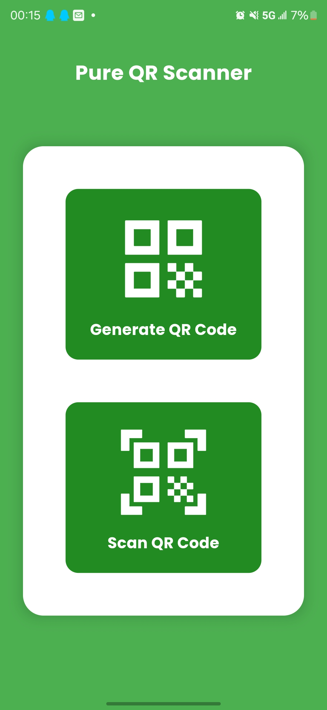
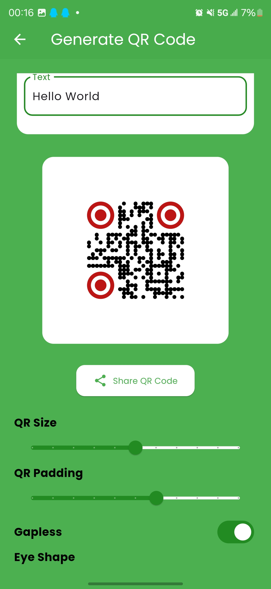
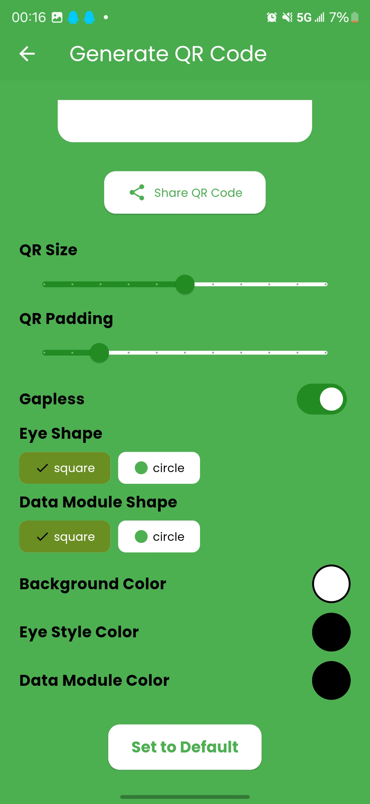
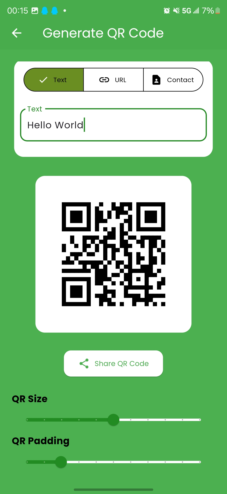
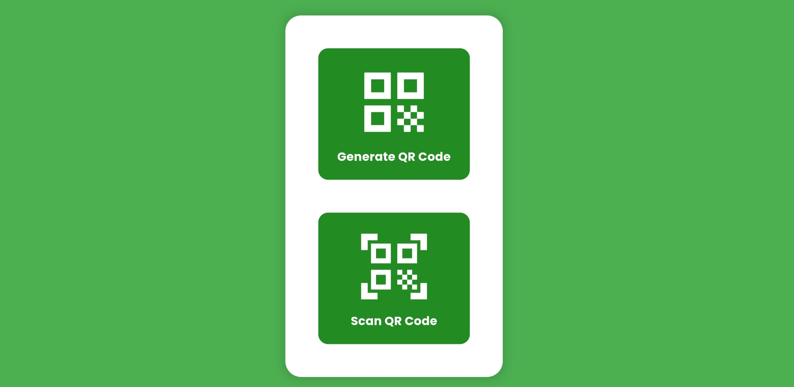
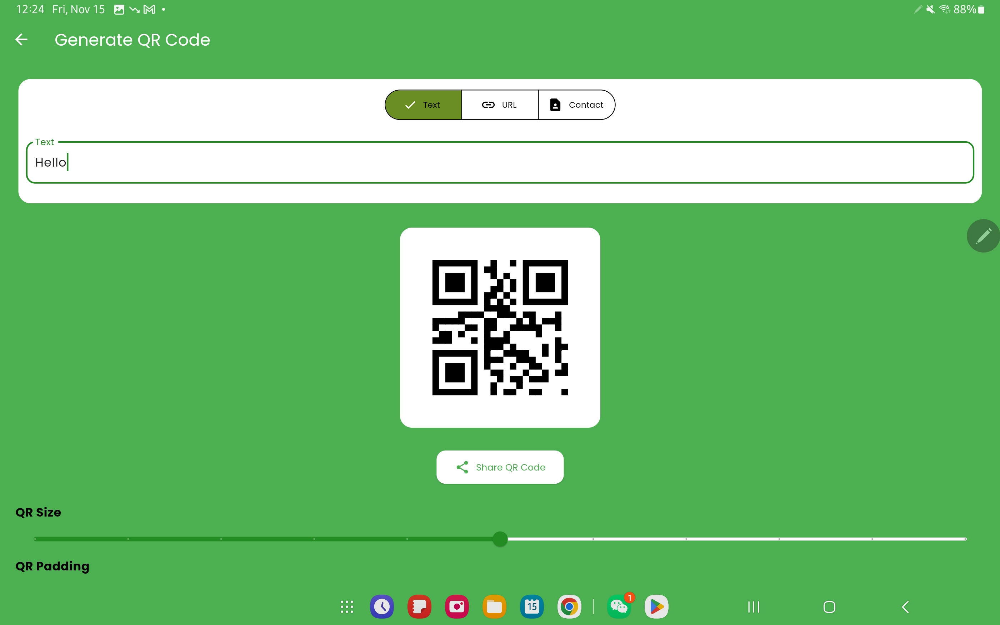

# cy_scan

A new Flutter project.

## Getting Started

This project is a starting point for a Flutter application.

A few resources to get you started if this is your first Flutter project:

### GO TO FUCKING: \android\gradle.properties, then add this line:

```
org.gradle.java.home=D:\\Java17\\jdk-17.0.12
```

Documentation will tell you no any fucking thing about this, but you need to do this to make it
work.

### analysis_options.yaml

```
include: package:flutter_lints/flutter.yaml 
```

This fucking line will force you to use the flutter lints, which may you don't want to use.

### set all color include system navigation bar color

```
import 'package:flutter/services.dart';
void main() {
  WidgetsFlutterBinding.ensureInitialized();

  SystemChrome.setSystemUIOverlayStyle(const SystemUiOverlayStyle(
  
    //This line is so fucking important, it will set the system navigation bar color
    // You need to restart the app to see the effect
  
    systemNavigationBarColor: Colors.green, // 设置系统导航栏背景颜色
    
    //================================================================================================
    
    systemNavigationBarIconBrightness: Brightness.light, // 设置导航栏图标颜色
    statusBarColor: Colors.green, // 设置状态栏颜色
    statusBarIconBrightness: Brightness.light, // 设置状态栏图标颜色
  ));

  runApp(const MyApp());
}

```

## Demo

### Phone Showing









### Tablet Showing






